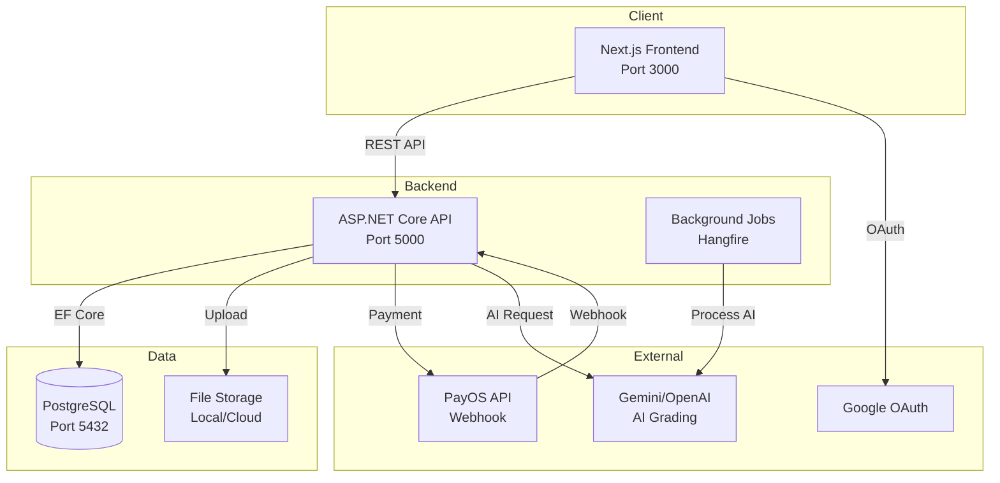
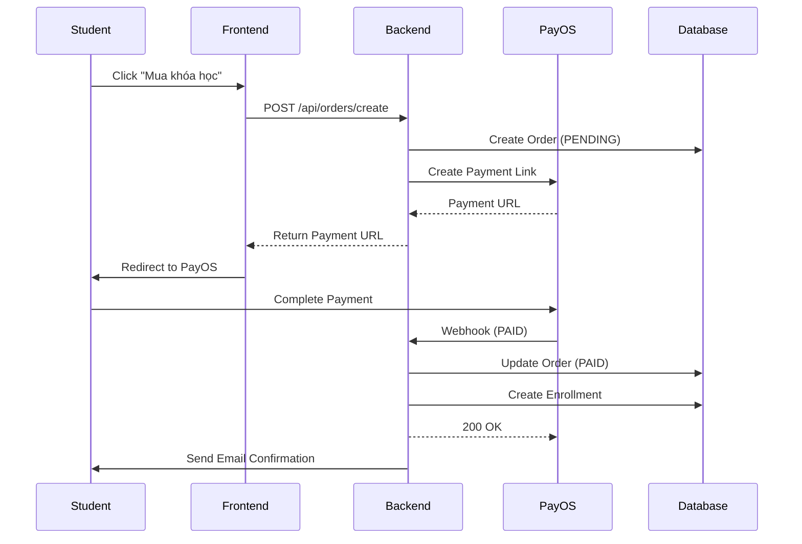

# PLAN: EdTech THPT Quốc Gia Platform

**Project Code**: `edtech-thpt`  
**Status**: 🔴 Planning  
**Target**: Production Deployment  
**Tech Stack**: Next.js 14 + ASP.NET Core (.NET 8) + PostgreSQL + PayOS + AI (Hybrid)

---

## 📊 PHASE 1: CONTEXT ANALYSIS

### Business Context
**Problem Statement:**
- Học sinh THPT Việt Nam cần nền tảng ôn thi THPT Quốc Gia có AI chấm bài tự động
- Giảng viên cần công cụ quản lý khóa học và theo dõi tiến độ học sinh
- Hệ thống cần hỗ trợ thanh toán và quản lý enrollment tự động

**Target Users:**
1. **Học sinh THPT** (lớp 10-11-12): Học, làm bài, xem feedback AI
2. **Giảng viên**: Tạo khóa học, bài tập, theo dõi học sinh
3. **Admin**: Quản lý người dùng, duyệt giảng viên, xem thống kê

**Success Metrics:**
- Thời gian phản hồi AI < 10s
- Uptime ≥ 99.5%
- Core Web Vitals: LCP < 2.5s, FID < 100ms, CLS < 0.1
- Security: OWASP Top 10 compliance

### Current State
- ✅ GEMINI.md đã định nghĩa architecture & roles
- ❌ Empty codebase (start from scratch)
- ❌ No database schema
- ❌ No PayOS integration

---

## 📋 PHASE 2: REQUIREMENT DEFINITION

### 2.1 User Stories & Acceptance Criteria

#### Epic 1: Authentication & Authorization

**US-1.1: Student Registration**
```gherkin
As a học sinh
I want to đăng ký tài khoản bằng email
So that I can truy cập hệ thống

Given I am on the registration page
When I submit email, password, name, grade, school
Then I receive a verification email
And my account is created with STUDENT role
```

**US-1.2: Google OAuth Login**
```gherkin
As a người dùng
I want to đăng nhập bằng Google
So that I can truy cập nhanh hơn

Given I am on the login page
When I click "Sign in with Google"
Then I am authenticated via Google OAuth
And I am redirected to my dashboard
```

**US-1.3: Instructor Approval Workflow**
```gherkin
As a giảng viên
I want to đăng ký tài khoản và chờ admin duyệt
So that I can tạo khóa học

Given I register as instructor
When admin approves my account
Then my status changes to APPROVED
And I can access instructor dashboard
```

---

#### Epic 2: Course Management

**US-2.1: Create Course (Instructor)**
```gherkin
As a giảng viên
I want to tạo khóa học với video & tài liệu
So that học sinh có thể mua và học

Given I am logged in as instructor
When I create course with name, subject, grade, price
And upload video files and documents
Then course is published and visible to students
```

**US-2.2: Browse Courses (Student)**
```gherkin
As a học sinh
I want to xem danh sách khóa học theo môn/lớp
So that I can tìm khóa phù hợp

Given I am on course catalog
When I filter by subject AND grade
Then I see matching courses with price and instructor
```

**US-2.3: Purchase Course via PayOS**
```gherkin
As a học sinh
I want to mua khóa học qua PayOS
So that I can truy cập nội dung

Given I select a paid course
When I complete PayOS payment
Then webhook confirms payment
And I am auto-enrolled in course
And order status is PAID
```

---

#### Epic 3: Learning & Assessment

**US-3.1: Watch Video Lessons**
```gherkin
As a học sinh
I want to xem video bài giảng
So that I can học kiến thức

Given I am enrolled in a course
When I click on a lesson
Then video player loads with progress tracking
```

**US-3.2: Submit Assignment (Multiple Choice)**
```gherkin
As a học sinh
I want to làm bài tập trắc nghiệm
So that I can kiểm tra kiến thức

Given I am viewing an assignment
When I select answers and submit
Then system auto-grades using rule-based logic
And I see score immediately
```

**US-3.3: AI Grading for Essay Questions**
```gherkin
As a học sinh
I want to nộp bài tự luận và nhận feedback AI
So that I can cải thiện kỹ năng

Given I submit an essay answer
When AI processes my submission
Then I receive:
  - Score (0-10)
  - Highlighted errors
  - Step-by-step correct solution
  - Explanation aligned with Bộ GD&ĐT curriculum
```

---

#### Epic 4: Admin Operations

**US-4.1: Approve/Reject Instructor**
```gherkin
As an admin
I want to duyệt hoặc từ chối giảng viên
So that I can kiểm soát chất lượng

Given pending instructor registrations exist
When I review profile and approve
Then instructor status = APPROVED
And instructor receives email notification
```

**US-4.2: Manual Enrollment**
```gherkin
As an admin
I want to thêm học sinh vào khóa học thủ công
So that I can hỗ trợ khóa miễn phí hoặc tặng

Given a student and a course
When I create manual enrollment
Then student accesses course without payment
```

**US-4.3: Analytics Dashboard**
```gherkin
As an admin
I want to xem thống kê doanh thu và người dùng
So that I can ra quyết định kinh doanh

Given I am on admin dashboard
When I view reports
Then I see:
  - Total revenue by month
  - Number of students/instructors
  - Course enrollment trends
  - PayOS transaction history
```

---

### 2.2 MoSCoW Prioritization

| Priority | Features |
|----------|----------|
| **MUST** | Auth (Email + Google OAuth), Course CRUD, Video player, PayOS integration, AI grading (basic), Role-based access |
| **SHOULD** | Instructor approval workflow, Analytics dashboard, Progress tracking, Document download |
| **COULD** | Real-time notifications, Course reviews, Bulk enrollment, Advanced AI (hints) |
| **WON'T** | Live streaming, Mobile app (v1), Gamification, Social features |

---

## 🏗️ PHASE 3: TECHNICAL BLUEPRINT

### 3.1 Tech Stack Rationale

| Layer | Technology | Why? |
|-------|-----------|------|
| **Frontend** | Next.js 14 (App Router) | SSR, SEO, TypeScript support, API Routes |
| **Styling** | TailwindCSS | Rapid development, mobile-first utilities |
| **Backend** | ASP.NET Core 8 | Clean Architecture, high performance, EF Core |
| **Database** | PostgreSQL | ACID compliance, JSON support, free & scalable |
| **ORM** | Entity Framework Core | Type-safe, migration support, LINQ queries |
| **Auth** | JWT + Refresh Tokens | Stateless, secure, role-based claims |
| **Payment** | PayOS (Production) | Vietnamese market, webhook support |
| **AI** | Gemini API / OpenAI | LLM for essay grading & feedback |
| **Storage** | Local/Cloudinary | Video & document hosting |
| **Deployment** | Docker + Railway/Vercel | Containerized, auto-scaling |

---

### 3.2 System Architecture



---

### 3.3 Database Schema (PostgreSQL)

#### Core Entities

```sql
-- Users
CREATE TABLE users (
    id UUID PRIMARY KEY DEFAULT gen_random_uuid(),
    email VARCHAR(255) UNIQUE NOT NULL,
    password_hash VARCHAR(255), -- nullable for OAuth users
    full_name VARCHAR(255) NOT NULL,
    role VARCHAR(20) NOT NULL CHECK (role IN ('STUDENT', 'INSTRUCTOR', 'ADMIN')),
    status VARCHAR(20) DEFAULT 'PENDING' CHECK (status IN ('PENDING', 'APPROVED', 'REJECTED', 'BLOCKED')),
    grade INT, -- for students (10, 11, 12)
    school VARCHAR(255),
    google_id VARCHAR(255) UNIQUE,
    created_at TIMESTAMP DEFAULT NOW(),
    updated_at TIMESTAMP DEFAULT NOW()
);

-- Courses
CREATE TABLE courses (
    id UUID PRIMARY KEY DEFAULT gen_random_uuid(),
    instructor_id UUID NOT NULL REFERENCES users(id) ON DELETE CASCADE,
    title VARCHAR(255) NOT NULL,
    description TEXT,
    subject VARCHAR(100) NOT NULL, -- "Toán", "Lý", "Hóa", etc.
    grade INT NOT NULL, -- 10, 11, 12
    price DECIMAL(10,2) NOT NULL DEFAULT 0,
    is_published BOOLEAN DEFAULT false,
    created_at TIMESTAMP DEFAULT NOW(),
    updated_at TIMESTAMP DEFAULT NOW()
);

-- Lessons
CREATE TABLE lessons (
    id UUID PRIMARY KEY DEFAULT gen_random_uuid(),
    course_id UUID NOT NULL REFERENCES courses(id) ON DELETE CASCADE,
    title VARCHAR(255) NOT NULL,
    video_url VARCHAR(500),
    document_url VARCHAR(500),
    order_index INT NOT NULL,
    created_at TIMESTAMP DEFAULT NOW()
);

-- Assignments
CREATE TABLE assignments (
    id UUID PRIMARY KEY DEFAULT gen_random_uuid(),
    course_id UUID NOT NULL REFERENCES courses(id) ON DELETE CASCADE,
    title VARCHAR(255) NOT NULL,
    type VARCHAR(20) NOT NULL CHECK (type IN ('MULTIPLE_CHOICE', 'ESSAY')),
    content JSONB NOT NULL, -- Questions array
    answers JSONB, -- Correct answers for auto-grading
    max_score DECIMAL(5,2) DEFAULT 10,
    created_at TIMESTAMP DEFAULT NOW()
);

-- Enrollments
CREATE TABLE enrollments (
    id UUID PRIMARY KEY DEFAULT gen_random_uuid(),
    student_id UUID NOT NULL REFERENCES users(id) ON DELETE CASCADE,
    course_id UUID NOT NULL REFERENCES courses(id) ON DELETE CASCADE,
    enrollment_type VARCHAR(20) DEFAULT 'PAID' CHECK (enrollment_type IN ('PAID', 'FREE', 'MANUAL')),
    enrolled_at TIMESTAMP DEFAULT NOW(),
    UNIQUE(student_id, course_id)
);

-- Submissions
CREATE TABLE submissions (
    id UUID PRIMARY KEY DEFAULT gen_random_uuid(),
    assignment_id UUID NOT NULL REFERENCES assignments(id) ON DELETE CASCADE,
    student_id UUID NOT NULL REFERENCES users(id) ON DELETE CASCADE,
    answers JSONB NOT NULL,
    score DECIMAL(5,2),
    ai_feedback JSONB, -- {errors: [], solution: "", explanation: ""}
    submitted_at TIMESTAMP DEFAULT NOW()
);

-- Orders (PayOS)
CREATE TABLE orders (
    id UUID PRIMARY KEY DEFAULT gen_random_uuid(),
    student_id UUID NOT NULL REFERENCES users(id) ON DELETE CASCADE,
    course_id UUID NOT NULL REFERENCES courses(id) ON DELETE CASCADE,
    amount DECIMAL(10,2) NOT NULL,
    status VARCHAR(20) DEFAULT 'PENDING' CHECK (status IN ('PENDING', 'PAID', 'FAILED', 'CANCELLED')),
    payos_order_id VARCHAR(255) UNIQUE,
    payos_transaction_id VARCHAR(255),
    created_at TIMESTAMP DEFAULT NOW(),
    updated_at TIMESTAMP DEFAULT NOW()
);

-- Indexes
CREATE INDEX idx_courses_subject_grade ON courses(subject, grade);
CREATE INDEX idx_enrollments_student ON enrollments(student_id);
CREATE INDEX idx_submissions_assignment ON submissions(assignment_id);
CREATE INDEX idx_orders_status ON orders(status);
```

---

### 3.4 Backend Structure (Clean Architecture)

```
backend/
├── EduVN.Domain/              # Core business entities
│   ├── Entities/
│   │   ├── User.cs
│   │   ├── Course.cs
│   │   ├── Lesson.cs
│   │   ├── Assignment.cs
│   │   ├── Submission.cs
│   │   ├── Enrollment.cs
│   │   └── Order.cs
│   ├── Enums/
│   │   ├── UserRole.cs
│   │   ├── UserStatus.cs
│   │   ├── AssignmentType.cs
│   │   └── OrderStatus.cs
│   └── Interfaces/
│       └── IEntity.cs
│
├── EduVN.Application/         # Business logic & use cases
│   ├── DTOs/
│   ├── UseCases/
│   │   ├── Auth/
│   │   │   ├── RegisterCommand.cs
│   │   │   ├── LoginCommand.cs
│   │   │   └── GoogleAuthCommand.cs
│   │   ├── Courses/
│   │   │   ├── CreateCourseCommand.cs
│   │   │   ├── GetCoursesQuery.cs
│   │   │   └── PurchaseCourseCommand.cs
│   │   ├── Assignments/
│   │   │   └── SubmitAssignmentCommand.cs
│   │   └── Admin/
│   │       └── ApproveInstructorCommand.cs
│   ├── Interfaces/
│   │   ├── IAuthService.cs
│   │   ├── IPaymentService.cs
│   │   └── IAIGradingService.cs
│   └── Validators/
│
├── EduVN.Infrastructure/      # External integrations
│   ├── Persistence/
│   │   ├── ApplicationDbContext.cs
│   │   ├── Configurations/
│   │   └── Migrations/
│   ├── Services/
│   │   ├── PayOSService.cs
│   │   ├── GeminiAIService.cs
│   │   ├── JwtTokenService.cs
│   │   └── GoogleOAuthService.cs
│   └── Repositories/
│
└── EduVN.API/                 # Web API layer
    ├── Controllers/
    │   ├── AuthController.cs
    │   ├── CoursesController.cs
    │   ├── AssignmentsController.cs
    │   ├── AdminController.cs
    │   └── WebhooksController.cs
    ├── Middleware/
    │   ├── ExceptionMiddleware.cs
    │   └── JwtMiddleware.cs
    ├── Program.cs
    └── appsettings.json
```

---

### 3.5 Frontend Structure (Next.js 14 App Router)

```
frontend/
├── app/
│   ├── (auth)/
│   │   ├── login/page.tsx
│   │   └── register/page.tsx
│   ├── (student)/
│   │   ├── dashboard/page.tsx
│   │   ├── courses/
│   │   │   ├── page.tsx              # Browse courses
│   │   │   └── [id]/
│   │   │       ├── page.tsx          # Course detail
│   │   │       └── lessons/[lessonId]/page.tsx
│   │   ├── assignments/[id]/page.tsx
│   │   └── progress/page.tsx
│   ├── (instructor)/
│   │   ├── courses/
│   │   │   ├── new/page.tsx
│   │   │   └── [id]/edit/page.tsx
│   │   └── students/page.tsx
│   ├── (admin)/
│   │   ├── users/page.tsx
│   │   ├── courses/page.tsx
│   │   └── analytics/page.tsx
│   ├── api/                          # API routes for server actions
│   ├── layout.tsx
│   └── page.tsx                      # Landing page
│
├── components/
│   ├── ui/                           # shadcn/ui components
│   ├── auth/
│   │   ├── LoginForm.tsx
│   │   └── GoogleSignInButton.tsx
│   ├── courses/
│   │   ├── CourseCard.tsx
│   │   ├── CourseFilter.tsx
│   │   └── VideoPlayer.tsx
│   ├── assignments/
│   │   ├── MultipleChoiceQuestion.tsx
│   │   ├── EssayQuestion.tsx
│   │   └── AIFeedbackDisplay.tsx
│   └── layout/
│       ├── Navbar.tsx
│       └── Sidebar.tsx
│
├── lib/
│   ├── api/                          # API client functions
│   ├── hooks/                        # Custom React hooks
│   ├── utils/
│   └── validations/
│
├── types/
│   └── index.ts                      # TypeScript definitions
│
└── public/
    └── assets/
```

---

### 3.6 AI Grading Strategy (Hybrid)

#### Rule-Based (Multiple Choice)
```typescript
function gradeMultipleChoice(submission: Submission, correctAnswers: Answer[]): number {
  let score = 0;
  submission.answers.forEach((answer, index) => {
    if (answer === correctAnswers[index]) {
      score += 1;
    }
  });
  return (score / correctAnswers.length) * 10;
}
```

#### LLM-Based (Essay)
```typescript
async function gradeEssay(studentAnswer: string, correctSolution: string): Promise<AIFeedback> {
  const prompt = `
Bạn là giáo viên luyện thi THPT Quốc Gia Việt Nam.

**Đáp án chuẩn:**
${correctSolution}

**Bài làm của học sinh:**
${studentAnswer}

**Nhiệm vụ:**
1. Chấm điểm (0-10)
2. Chỉ ra từng lỗi sai cụ thể
3. Giải thích vì sao sai
4. Đưa ra lời giải đúng từng bước

**Định dạng JSON:**
{
  "score": 7.5,
  "errors": [
    {"line": 2, "error": "Sai công thức tính...", "correction": "Công thức đúng là..."}
  ],
  "solution": "Bước 1:... Bước 2:...",
  "explanation": "Bài làm đúng ở... nhưng sai ở..."
}
`;

  const response = await geminiAPI.generateContent(prompt);
  return JSON.parse(response);
}
```

---

### 3.7 PayOS Integration Flow



**Webhook Security:**
- Verify signature using PayOS secret
- Check order exists and is PENDING
- Idempotent processing (prevent double enrollment)

---

## ✅ PHASE 4: TASK ORCHESTRATION

### Milestone 1: Foundation Setup (Week 1)

#### Task 1.1: Initialize Backend Project
**Agent**: `@backend-specialist`  
**Skills**: `full-stack-scaffold`, `database-migration`  
**Commands**:
```bash
cd d:\hoconhanho
mkdir backend && cd backend
dotnet new sln -n EduVN
dotnet new webapi -n EduVN.API
dotnet new classlib -n EduVN.Domain
dotnet new classlib -n EduVN.Application
dotnet new classlib -n EduVN.Infrastructure
dotnet sln add **/*.csproj
```

**VERIFY**:
- [ ] Solution builds without errors
- [ ] Clean Architecture folders created
- [ ] NuGet packages installed (EF Core, AutoMapper, FluentValidation, JWT)

---

#### Task 1.2: Database Setup & Migrations
**Agent**: `@backend-specialist`  
**Skills**: `database-migration`, `@[.agent/.shared/database-master.md]`  
**Steps**:
1. Configure `ApplicationDbContext` with entity configurations
2. Create initial migration: `dotnet ef migrations add InitialCreate`
3. Update database: `dotnet ef database update`
4. Seed admin user

**VERIFY**:
- [ ] PostgreSQL database created
- [ ] All tables exist with correct schema
- [ ] Foreign keys and indexes applied
- [ ] Admin user seeded (email: admin@eduvn.com, password: Admin@123)

---

#### Task 1.3: Initialize Frontend Project
**Agent**: `@frontend-specialist` (NOT `@mobile-developer`)  
**Skills**: `modern-web-architect`, `full-stack-scaffold`  
**Commands**:
```bash
cd d:\hoconhanho
npx create-next-app@latest frontend --typescript --tailwind --app --src-dir --import-alias "@/*"
cd frontend
npm install axios react-query @tanstack/react-query zustand
npm install -D @types/node
```

**VERIFY**:
- [ ] Next.js 14 with App Router initialized
- [ ] TailwindCSS configured
- [ ] TypeScript strict mode enabled
- [ ] Dev server runs on localhost:3000

---

### Milestone 2: Authentication & Authorization (Week 2)

#### Task 2.1: JWT Authentication
**Agent**: `@backend-specialist`  
**Skills**: `@[.agent/.shared/security-armor.md]`, `api-documenter`  
**Implementation**:
- Create `JwtTokenService` (access + refresh tokens)
- Implement `AuthController` (register, login, refresh)
- Add JWT middleware for protected routes
- Configure role-based policies

**VERIFY**:
- [ ] User can register and receive JWT
- [ ] Login returns access token (15min) + refresh token (7d)
- [ ] Protected endpoints require valid token
- [ ] Token includes role claims

---

#### Task 2.2: Google OAuth Integration
**Agent**: `@backend-specialist`  
**Skills**: `@[.agent/.shared/api-standards.md]`  
**Steps**:
1. Register Google OAuth app (get CLIENT_ID, CLIENT_SECRET)
2. Create `GoogleOAuthService`
3. Add endpoint: `POST /api/auth/google` (exchange code for token)
4. Create/update user with `google_id`

**VERIFY**:
- [ ] Google Sign-In button works
- [ ] User authenticated via Google
- [ ] Profile synced (email, name, avatar)

---

#### Task 2.3: Frontend Auth UI
**Agent**: `@frontend-specialist`  
**Skills**: `modern-web-architect`, `@[.agent/.shared/ui-ux-pro-max.md]`  
**Deliverables**:
- `LoginForm.tsx` (email/password)
- `RegisterForm.tsx` (student/instructor selection)
- `GoogleSignInButton.tsx`
- Auth state management (Zustand)
- Protected route wrapper

**VERIFY**:
- [ ] Forms validated with Zod
- [ ] Error messages displayed
- [ ] Token persisted in localStorage
- [ ] Redirect after login based on role

---

### Milestone 3: Course Management (Week 3-4)

#### Task 3.1: Course CRUD Backend
**Agent**: `@backend-specialist`  
**Skills**: `@[.agent/.shared/api-standards.md]`, `api-documenter`  
**Endpoints**:
- `POST /api/courses` (instructor only)
- `GET /api/courses?subject=Toán&grade=12` (public)
- `GET /api/courses/{id}` (public)
- `PUT /api/courses/{id}` (instructor/admin)
- `DELETE /api/courses/{id}` (admin only)

**VERIFY**:
- [ ] OpenAPI docs generated
- [ ] Authorization enforced
- [ ] Pagination & filtering work
- [ ] Instructor can only edit own courses

---

#### Task 3.2: File Upload (Video & Documents)
**Agent**: `@backend-specialist`  
**Skills**: `cloud-architect-master` (if using cloud storage)  
**Options**:
- **Local**: Save to `wwwroot/uploads/`
- **Cloud**: Cloudinary/AWS S3

**VERIFY**:
- [ ] Upload accepts MP4, PDF, DOCX
- [ ] File size limit enforced (max 500MB for video)
- [ ] URLs returned in response
- [ ] Clean up orphaned files on delete

---

#### Task 3.3: Course Catalog UI
**Agent**: `@frontend-specialist`  
**Skills**: `modern-web-architect`, `seo-expert-kit`  
**Components**:
- `CourseCard.tsx` (thumbnail, title, price, instructor)
- `CourseFilter.tsx` (subject, grade, price range)
- `CoursesPage.tsx` (grid layout with pagination)

**VERIFY**:
- [ ] SSR for SEO (meta tags, structured data)
- [ ] Image optimization (Next.js Image)
- [ ] Responsive grid (1-2-3-4 columns)
- [ ] Loading states & error handling

---

#### Task 3.4: Video Player & Lesson Tracking
**Agent**: `@frontend-specialist`  
**Skills**: `performance-engineer`  
**Features**:
- Embed video.js or Plyr
- Track watch progress
- Prevent download (basic DRM via HLS)

**VERIFY**:
- [ ] Video plays smoothly
- [ ] Progress saved on pause
- [ ] Resume from last position
- [ ] Lazy load video components

---

### Milestone 4: PayOS Integration (Week 5)

#### Task 4.1: PayOS Service Implementation
**Agent**: `@backend-specialist`  
**Skills**: `@[.agent/.shared/security-armor.md]`  
**Steps**:
1. Install PayOS SDK: `dotnet add package PayOS`
2. Create `PayOSService.cs`:
   - `CreatePaymentLink(orderId, amount, returnUrl)`
   - `VerifyWebhookSignature(signature, body)`
3. Add `WebhooksController`: `POST /api/webhooks/payos`

**VERIFY**:
- [ ] Payment link generated
- [ ] Webhook signature validated
- [ ] Order updated to PAID
- [ ] Enrollment created atomically (transaction)

---

#### Task 4.2: Checkout Flow UI
**Agent**: `@frontend-specialist`  
**Skills**: `cro-expert-kit` (Conversion Rate Optimization)  
**Flow**:
1. Student clicks "Mua khóa học"
2. Confirm modal with price & course details
3. Redirect to PayOS
4. Return to `/payment/success?orderId=xxx`

**VERIFY**:
- [ ] Loading indicator during redirect
- [ ] Success page shows enrollment details
- [ ] Error handling (failed payment)
- [ ] Clear CTA and pricing display

---

### Milestone 5: Assignment & AI Grading (Week 6-7)

#### Task 5.1: Assignment Backend
**Agent**: `@backend-specialist`  
**Skills**: `@[.agent/.shared/api-standards.md]`  
**Endpoints**:
- `POST /api/assignments` (instructor)
- `GET /api/courses/{courseId}/assignments`
- `POST /api/assignments/{id}/submit` (student)

**VERIFY**:
- [ ] JSONB storage for questions/answers
- [ ] Validation for assignment types
- [ ] Anti-cheat: check enrollment before submit

---

#### Task 5.2: AI Grading Service (Hybrid)
**Agent**: `@backend-specialist`  
**Skills**: `ai-engineer`, `@[.agent/.shared/ai-master.md]`  
**Implementation**:
```csharp
public class AIGradingService : IAIGradingService
{
    public async Task<GradingResult> GradeSubmission(Assignment assignment, Submission submission)
    {
        if (assignment.Type == AssignmentType.MultipleChoice)
        {
            return GradeMultipleChoice(assignment.Answers, submission.Answers);
        }
        else
        {
            return await GradeEssayWithLLM(assignment.Content, submission.Answers);
        }
    }
}
```

**VERIFY**:
- [ ] Multiple choice scored instantly
- [ ] Essay graded via Gemini API in <10s
- [ ] Feedback stored in JSONB
- [ ] Retry logic for API failures

---

#### Task 5.3: Assignment Submission UI
**Agent**: `@frontend-specialist`  
**Skills**: `modern-web-architect`, `@[.agent/.shared/ui-ux-pro-max.md]`  
**Components**:
- `MultipleChoiceQuestion.tsx` (radio buttons)
- `EssayQuestion.tsx` (rich text editor or textarea)
- `AIFeedbackDisplay.tsx` (highlight errors, show solution)

**VERIFY**:
- [ ] Form state managed (auto-save drafts)
- [ ] Submit confirmation
- [ ] Feedback displayed with syntax highlighting
- [ ] Mobile-friendly forms

---

### Milestone 6: Admin & Instructor Features (Week 8)

#### Task 6.1: Instructor Approval Workflow
**Agent**: `@backend-specialist`  
**Skills**: `@[.agent/.shared/api-standards.md]`  
**Endpoints**:
- `GET /api/admin/instructors/pending`
- `POST /api/admin/instructors/{id}/approve`
- `POST /api/admin/instructors/{id}/reject`

**VERIFY**:
- [ ] Admin can view pending instructors
- [ ] Email sent on approval/rejection
- [ ] Status updated in DB

---

#### Task 6.2: Manual Enrollment
**Agent**: `@backend-specialist`  
**Implementation**:
- `POST /api/admin/enrollments` (studentId, courseId, type=MANUAL)

**VERIFY**:
- [ ] Admin can enroll student without payment
- [ ] Duplicate enrollment prevented
- [ ] Audit log created

---

#### Task 6.3: Analytics Dashboard
**Agent**: `@frontend-specialist`  
**Skills**: `modern-web-architect`, `@[.agent/.shared/metrics.md]`  
**Metrics**:
- Total revenue (sum of PAID orders)
- Active students/instructors
- Course enrollment trends (chart.js / recharts)
- Recent transactions table

**VERIFY**:
- [ ] Data fetched from backend analytics API
- [ ] Charts render correctly
- [ ] Filters by date range work

---

### Milestone 7: Testing & Quality Assurance (Week 9)

#### Task 7.1: Backend Unit Tests
**Agent**: `@backend-specialist`  
**Skills**: `@[.agent/.shared/testing-master.md]`  
**Coverage**:
- Auth service (register, login, JWT generation)
- Course service (CRUD, authorization)
- PayOS webhook handler
- AI grading logic

**VERIFY**:
- [ ] >80% code coverage
- [ ] All edge cases tested
- [ ] Mock external APIs (PayOS, Gemini)

---

#### Task 7.2: Frontend E2E Tests
**Agent**: `@frontend-specialist`  
**Skills**: `@[.agent/skills/playwright-testing]`  
**Scenarios**:
1. Student registration → login → browse courses
2. Purchase course → payment success → enrollment
3. Submit assignment → receive AI feedback
4. Instructor creates course → uploads video

**VERIFY**:
- [ ] Playwright tests pass
- [ ] Runs in CI/CD pipeline
- [ ] Screenshots on failure

---

#### Task 7.3: Security Audit
**Agent**: `@security-auditor`  
**Skills**: `security-auditor`, `penetration-tester-master`  
**Checks**:
- [ ] SQL injection protection (EF parameterization)
- [ ] XSS prevention (output encoding)
- [ ] CSRF tokens
- [ ] JWT secret not exposed
- [ ] PayOS webhook signature validated
- [ ] HTTPS enforced
- [ ] Rate limiting on auth endpoints

---

### Milestone 8: Deployment & Monitoring (Week 10)

#### Task 8.1: Dockerize Backend
**Agent**: `@backend-specialist`  
**Skills**: `deployment-engineer`, `cloud-architect-master`  
**Dockerfile**:
```dockerfile
FROM mcr.microsoft.com/dotnet/aspnet:8.0 AS base
WORKDIR /app
EXPOSE 5000

FROM mcr.microsoft.com/dotnet/sdk:8.0 AS build
WORKDIR /src
COPY . .
RUN dotnet restore
RUN dotnet publish -c Release -o /app/publish

FROM base AS final
WORKDIR /app
COPY --from=build /app/publish .
ENTRYPOINT ["dotnet", "EduVN.API.dll"]
```

**VERIFY**:
- [ ] Docker image builds
- [ ] Container runs and connects to PostgreSQL
- [ ] Health check endpoint works

---

#### Task 8.2: Deploy Frontend to Vercel
**Agent**: `@frontend-specialist`  
**Skills**: `deployment-engineer`  
**Steps**:
1. Connect GitHub repo to Vercel
2. Set environment variables (NEXT_PUBLIC_API_URL)
3. Deploy with auto-preview on PR

**VERIFY**:
- [ ] Production URL accessible
- [ ] Environment variables loaded
- [ ] Build logs clean

---

#### Task 8.3: Database Migration in Production
**Agent**: `@backend-specialist`  
**Skills**: `database-migration`  
**Strategy**:
- Blue-Green deployment
- Run migrations before deploying new code
- Rollback plan documented

**VERIFY**:
- [ ] Migrations applied without downtime
- [ ] Data integrity maintained
- [ ] Backup created before migration

---

#### Task 8.4: Monitoring & Logging
**Agent**: `@performance-engineer`  
**Skills**: `performance-engineer`, `incident-responder`  
**Tools**:
- Application Insights / Sentry (error tracking)
- Prometheus + Grafana (metrics)
- ELK Stack (logs)

**VERIFY**:
- [ ] Errors logged and alerted
- [ ] Response time metrics tracked
- [ ] Database query performance monitored

---

## 📊 VERIFICATION CHECKLIST

### Functional Requirements
- [ ] All 3 user roles can authenticate
- [ ] Google OAuth works
- [ ] Instructor approval workflow functional
- [ ] Courses CRUD complete
- [ ] Video player works
- [ ] PayOS payment completes and enrolls student
- [ ] Multiple choice auto-graded
- [ ] Essay graded by AI with feedback
- [ ] Admin can manage users and courses
- [ ] Analytics dashboard displays correct data

### Non-Functional Requirements
- [ ] API response time <500ms (95th percentile)
- [ ] AI grading time <10s
- [ ] Frontend LCP <2.5s
- [ ] 99.5% uptime (verified via monitoring)
- [ ] Mobile-responsive UI
- [ ] WCAG AA accessibility
- [ ] OWASP Top 10 mitigations applied

### Security
- [ ] JWT tokens expire correctly
- [ ] Refresh token rotation implemented
- [ ] PayOS webhook signature verified
- [ ] No secrets in version control
- [ ] HTTPS enforced
- [ ] Input validation on all endpoints

### Performance
- [ ] Database indexes on frequent queries
- [ ] Video streaming optimized (HLS/DASH)
- [ ] Frontend code splitting
- [ ] Static assets cached (CDN)
- [ ] API rate limiting configured

---

## 🚀 NEXT STEPS

After approval of this plan:

1. **Run `/create`** to start implementation
2. **Set up development environment**:
   - Install .NET 8 SDK
   - Install Node.js 20+
   - Install PostgreSQL 15+
   - Register PayOS Production account
   - Get Gemini API key
3. **Create `.env` files** (use `.env.example` templates)
4. **Follow milestones sequentially**
5. **Run `/test` after each milestone**

---

**Plan File**: `docs/PLAN-edtech-thpt.md`  
**Estimated Timeline**: 10 weeks (full-time)  
**Team Size**: 1-2 developers  
**Budget**: ~$200/month (hosting + APIs)

---

*Generated by @project-planner | Antigravity Agent*  
*Last Updated: 2026-01-30*
